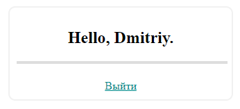

# ОТЧЁТ О ЛАБОРАТОРНОЙ РАБОТЕ №1
#### *По курсу "Основы Программирования"*
#### *Работу выполнил студент группы №3131 Беляев Д.Н.*
#### [Ссылка на GitHub](https://github.com/FireIceMage/Lab1)

## Цель работы:
Спроектировать и разработать систему авторизации пользователей на протоколе HTTP

## Ход работы
### Пользовательский интерфейс
1. Страница входа                       
   
2. Страница регистрации                          
   
3. Главная страница сайта                              
   
   
### Пользовательский сценарий
1. Пользователь не имеет аккаунта. Он переходит на страницу signup.php и нажимает зарегистрироваться. На экране появляется сообщение "Заполните это поле". Далее вводдит все данные, но пользователь с таким логином уже есть, на экране появляется "Такой пользователь уже есть". При регистрации с другом логином, пароль не был подтвержден и выводится сообщение "Пароли не совпадают". Все поля были заполнены, логин уникальный и пароли совпали, тогда пользователь переходит на страницу авторизации, вводит логин и пароль, и попадает на главную страницу.   
2. Пользователь имеет аккаунт. Он переходит на страницу index.php и нажимает войти. На экране появляется сообщение "Заполните это поле". Далее вводит все данные, но неверно, на экране появляется сообщение "Неправильный логин или пароль". Тогда пользователь повторно вводит данные, но уже верно и попадает на главную страницу.
3. Пользователь пытается перейти на главную страницу без авторизации. Он вводит в адресной строке profile.php и перенаправляется на index.php. Вводит данные и попадает на главную страницу.

### API сервера
Сервер использует HTTP GET запросы с полями login (логин) и password (пароль). 
### Хореография
1. *Вход*. Отправляется запрос, который ищет в базе данных пользователя с таким логином и хешем пароля. При условии, что поле или поля оказались пустыми, то на экране появится "Заполните это поле". Если находит, то совершается вход на главную страницу. Если нет, то пользователь получает сообщение "Неправильный логин или пароль".  
2. *Регистрация*. Принимаются все введенные данные, пароль хешируется. Далее отправляется запрос, который ищет пользователя с таким логином. Если остались пустые поля, то сайт попросит заполнить их. Если такой логин уже использвуется, то появляется сообщение "Такой пользователь уже есть". Если логин не найден, то отправляется запрос на добавление пользователя в базу данных, затем пользователь оказывается на странице авторизации.
3. *Аутентификация*. Если существует переменная, которая содержит информацию о пользователе, то разрешается переход на главную страницу. Если нет, то происходит переход на страницу авторизации.

## Описание структуры базы данных
Браузерное приложение phpMyAdminДля используется для просмотра содержимого базы данных. Всего 4 столбца:
1. "id" типа int с автоинкрементом для выдачи уникальных id всем пользователям
2. "login" типа varchar для хранения логина пользователя
3. "name" типа varchar для хранения имени пользователя
4. "password" типа varchar для хранения пароля пользователя в виде хеша

## Описание алгоритмов
1. Алгоритм входа на сайт                        
   
2. Алгоритм регистрации на сайте               
   
3. Алгоритм аутентификации пользователя        
   
## Примеры HTTP запросов/ответов


## Значимые фрагменты кода
1. Алгоритм входа на сайт
```
if (mysqli_num_rows($check_user) > 0){
        $user = mysqli_fetch_assoc($check_user);
        $_SESSION['user'] = [
            "id" => $user['id'],
            "name" => $user['name']
        ];

        header('Location: profile.php');
    }
    else{
        $_SESSION['message'] = 'Неправильный логин или пароль';
        header('Location: ../index.php' );
    }
```
2. Алгоритм регистрации на сайте
```
if ( $password === $password_confirm){
        if (mysqli_num_rows($check_login) === 0){
            $password = md5($password);
            mysqli_query($connect, "INSERT INTO `users` (`id`, `login`,`name`, `password`) VALUES (NULL, '$login','$name', '$password')");
            $_SESSION['message'] = 'Регистрация прошла успешно!';
            header('Location: ../index.php' );
        }
       else{
            $_SESSION['message'] = 'Такой пользователь уже есть';
            header('Location: ../register.php' );
       }
    }
    else{
        $_SESSION['message'] = 'Пароли не совпадают';
        header('Location: ../register.php' );
    }
```
3. Функция аутентификации пользователя
```
if ($_SESSION['user']){
    header('Location: includes/profile.php');
}
```